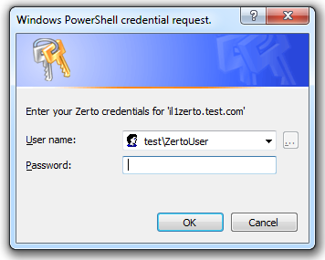

 

Setup 
======

Installing the module – The ZertoModule is published on
PowershellGallery and is easy to install:

```PowerShell
PS C:\Scripts\Zerto> Install-Module -Name ZertoModule
```

PowerShell Script modules cannot be auto-imported, so you need to import
the `ZertoModule`

```PowerShell
PS C:\Scripts\Zerto> Import-Module ZertoModule
```
 Authentication
===============

Authentication is simple:

```PowerShell
PS C:\Scripts\Zerto> Connect-ZertoZVM -ZertoServer "il1zerto.test.com" -ZertoUser "Test\ZertoUser"
```

You will need to enter your password:


   

You can verify your connection using:

```PowerShell
PS C:\Scripts\Zerto> Get-ZertoLocalSite
 
ContactEmail : noc@Test.com
ContactName : NOC
ContactPhone : 847-555-1212
IpAddress : 10.77.199.10
IsReplicationToSelfEnabled : True
Link : @{href=https://10.77.199.10:9669/v1/localsite;
identifier=d492497e-6793-4ec8-b44b-f60a43aef445; rel=;
type=LocalSiteApi}
Location : Chicago, IL
SiteIdentifier : d492497e-6793-4ec8-b44b-f60a43aef445
SiteName : Zerto-IL1
SiteType : VCenter
UtcOffsetInMinutes : -300
Version : 5.0.21
```
VRA Information
===============

Retrieving VRA information is simple:

```PowerShell
PS C:\Scripts\Zerto> Get-ZertoVRA | Select-Object VraGroup, VraName,VraVersion, IpAddress, NetworkName, MemoryInGB | Format-Table
 
VraGroup VraName                    VraVersion IpAddress     NetworkName MemoryInGB
-------- -------                    ---------- ---------    ----------- ----------
IL1-VRA Z-VRA-il1ep0426esx.test.com 5.0        10.77.199.19 vlan99rpl           16
IL1-VRA Z-VRA-il1ep0428esx.test.com 5.0        10.77.199.21 vlan99rpl           16
IL1-VRA Z-VRA-il1ep0429esx.test.com 5.0        10.77.199.22 vlan99rpl           16
IL1-VRA Z-VRA-il1ep0425esx.test.com 5.0        10.77.199.18 vlan99rpl           16
IL1-VRA Z-VRA-il1ep0423esx.test.com 5.0        10.77.199.16 vlan99rpl           16
IL1-VRA Z-VRA-il1ep0424esx.test.com 5.0        10.77.199.17 vlan99rpl           16
IL1-VRA Z-VRA-il1ep0418esx.test.com 5.0        10.77.199.11 vlan99rpl           16
IL1-VRA Z-VRA-il1ep0419esx.test.com 5.0        10.77.199.12 vlan99rpl           16
IL1-VRA Z-VRA-il1ep0420esx.test.com 5.0        10.77.199.13 vlan99rpl           16
IL1-VRA Z-VRA-il1ep0421esx.test.com 5.0        10.77.199.14 vlan99rpl           16
IL1-VRA Z-VRA-il1ep0422esx.test.com 5.0        10.77.199.15 vlan99rpl           16
IL1-VRA Z-VRA-il1ep0427esx.test.com 5.0        10.77.199.20 vlan99rpl           16
IL1-VRA Z-VRA-il1ep0444esx.test.com 5.0        10.77.199.27 vlan99rpl           16
IL1-VRA Z-VRA-il1ep0445esx.test.com 5.0        10.77.199.28 vlan99rpl           16
IL1-VRA Z-VRA-il1ep0442esx.test.com 5.0        10.77.199.25 vlan99rpl           16
IL1-VRA Z-VRA-il1ep0443esx.test.com 5.0        10.77.199.26 vlan99rpl           16
IL1-VRA Z-VRA-il1ep0447esx.test.com 5.0        10.77.199.30 vlan99rpl           16
IL1-VRA Z-VRA-il1ep0446esx.test.com 5.0        10.77.199.29 vlan99rpl           16
IL1-VRA Z-VRA-il1ep0440esx.test.com 5.0        10.77.199.23 vlan99rpl           16
IL1-VRA Z-VRA-il1ep0441esx.test.com 5.0        10.77.199.24 vlan99rpl           16
```

Upgrading VRAs uses a single command:

```PowerShell
PS C:\Scripts\Zerto> Invoke-ZertoVRAUpgrade -ZertoVraIdentifier (Get-ZertoVRAID -VraName 'Z-VRA-il1ep0426esx.test.com')

c2a7af90-5782-4001-abf6-6c547579fb93:d492497e-6793-4ec8-b44b-f60a43aef445
```

This api returns a Zerto TaskID that can be viewed:

```
PS C:\Scripts\Zerto> Get-ZertoTask -ZertoTaskIdentifier c2a7af90-5782-4001-abf6-6c547579fb93:d492497e-6793-4ec8-b44b-f60a43aef445

CompleteReason  :
Completed       : 5/15/2017 3:19:25 PM
InitiatedBy     : ZertoAccount
IsCancellable   : False
Link            : @{href=https://10.77.199.10:9669/v1/tasks/c2a7af90-5782-4001-abf6-6c547579fb93.d492497e-6793-4ec8-b44b-f60a43aef445;
identifier=c2a7af90-5782-4001-abf6-6c547579fb93.d492497e-6793-4ec8-b44b-f60a43aef445;rel=; type=TaskApi}
RelatedEntities : @{Hosts=System.Object\[\]; Sites=System.Object\[\];Vpgs=System.Object\[\]; FlrSessions=System.Object\[\]}
Started         : 5/15/2017 3:19:25 PM
Status          : @{Progress=100; State=6}
TaskIdentifier  : c2a7af90-5782-4001-abf6-6c547579fb93.d492497e-6793-4ec8-b44b-f60a43aef445
Type            : UpgradeVra
```

Looking at this Tasks' status:

```PowerShell
PS C:\Scripts\Zerto> (Get-ZertoTask -ZertoTaskIdentifier c2a7af90-5782-4001-abf6-6c547579fb93:d492497e-6793-4ec8-b44b-f60a43aef445).Status

Progress State
-------- -----
100      6

PS C:\Scripts\Zerto> Get-ZertoTaskState -ZertoTaskStateID 6
Completed
```

VPG Information
===============

Retrieving VPG Information is equally simple

```PowerShell
PS C:\Scripts\Zerto> Get-ZertoVPG | Select-object VpgName,SourceSite, TargetSite, ActualRPO, VmsCount,@{n='Status';e={Get-ZertoVPGStatus -ZertoVPGStatusID $_.Status}} | ft

VpgName                                   SourceSite TargetSite ActualRPO VmsCount       Status
-------                                   ---------- ---------- --------- --------       ------
ZertoMIGGROUP03DEV_FP-DENPDB-IL1WD0271APP Zerto-IL1 DENPDB            16       1    MeetingSLA
ZertoMIGGROUP03DEV_FP-DENPDB-IL1WD0272DB  Zerto-IL1 DENPDB            -1       1  Initializing
ZertoMIGGROUP03DEV_FP-DENPDB-IL1WD0685APP Zerto-IL1 DENPDB            -1       1  Initializing
ZertoMIGGROUP03DEV_FP-DENPDB-IL1WD0692WEB Zerto-IL1 DENPDB            16       1    MeetingSLA
ZertoMIGGROUP03DEV_FP-DENPDB-IL1WD0561DB  Zerto-IL1 DENPDB            -1       1  Initializing
ZertoMIGGROUP03DEV_FP-DENPDB-IL1WD0861APP Zerto-IL1 DENPDB            16       1    MeetingSLA
ZertoMIGGROUP03DEV_FP-DENPDB-IL1WD0773DB  Zerto-IL1 DENPDB            -1       1  Initializing
ZertoMIGGROUP03DEV_FP-DENPDB-IL1WD0860APP Zerto-IL1 DENPDB            16       1    MeetingSLA
ZertoMIGGROUP03DEV_FP-DENPDB-IL1WD0883APP Zerto-IL1 DENPDB            16       1    MeetingSLA
ZertoMIGGROUP03DEV_FP-DENPDB-IL1WD0884WEB Zerto-IL1 DENPDB            16       1    MeetingSLA
ZertoMIGGROUP03DEV_FP-DENPDB-IL1WD0936APP Zerto-IL1 DENPDB            -1       1  Initializing
ZertoMIGGROUP03DEV_FP-DENPDB-IL1WD0885DB  Zerto-IL1 DENPDB            -1       1  Initializing
ZertoMIGGROUP03DEV_FP-DENPDB-IL1WD0937APP Zerto-IL1 DENPDB            -1       1  Initializing
ZertoMIGGROUP03DEV_FP-DENPDB-IL1WD1029APP Zerto-IL1 DENPDB            16       1    MeetingSLA
ZertoMIGGROUP03DEV_FP-DENPDB-IL1WD0939DB  Zerto-IL1 DENPDB            16       1    MeetingSLA
ZertoMIGGROUP03DEV_FP-DENPDB-IL1WD0938DB  Zerto-IL1 DENPDB            -1       1  Initializing
ZertoMIGGROUP03DEV_FP-DENPDB-ND872APP     Zerto-IL1 DENPDB            16       1    MeetingSLA 
ZertoMIGGROUP03DEV_FP-DENPDB-IL1WD1026DB  Zerto-IL1 DENPDB            -1       1  Initializing
COMMCORE-FAILBACK                         DENPDB   Zerto-IL1          11       3    MeetingSLA
```
VPG Creation
============

Creating a simple VPG – no IP reassignment

```PowerShell
PS C:\Scripts\Zerto> Add-ZertoVPG -Priority Low `
                            -VPGName "ChrisLewisVPG" `
                            -RecoverySiteName 'CHAPDA' `
                            -ClusterName 'CHAPDA3ZMNA01' `
                            -FailoverNetwork 'PD3Z_Test_367' `
                            -TestNetwork 'PD3Z_Test_367' `
                            -DatastoreName 'CHAPDA3Z_MNA01' `
                            -JournalUseDefault $True `
                            -Folder 'ZertoRecoveryFolder' `
                            -VmNames 'WATERMELON-V'

28842f79-7c15-40cd-bb88-431869baa125.258fcb39-d6a3-4547-8797-3605da6d372b
```

This returns a Zerto Task ID:

```PowerShell
PS C:\Scripts\Zerto> Get-ZertoTask -ZertoTaskIdentifier '28842f79-7c15-40cd-bb88-431869baa125.258fcb39-d6a3-4547-8797-3605da6d372b'

CompleteReason  :
Completed       :
InitiatedBy     : ZertoUser
IsCancellable   : False
Link            : @{href=https://10.77.199.10:9669/v1/tasks/28842f79-7c15-40cd-bb88-431869baa125.258fcb39-d6a3-4547-8797-3605da6d372b;
identifier=28842f79-7c15-40cd-bb88-431869baa125.258fcb39-d6a3-4547-8797-3605da6d372b;
rel=; type=TaskApi}
RelatedEntities : @{Hosts=System.Object\[\]; Sites=System.Object\[\];
Vpgs=System.Object\[\]; FlrSessions=System.Object\[\]}
Started         : 5/17/2017 1:53:43 PM
Status          : @{Progress=79; State=1}
TaskIdentifier  : 28842f79-7c15-40cd-bb88-431869baa125.258fcb39-d6a3-4547-8797-3605da6d372b
Type            : CreateProtectionGroup
```

This just creates a VPG with a single VM. Adding additional VM's is
easy, just change the line

```PowerShell
    -VmNames 'WATERMELON-V'
```
to use an array of VM names

```PowerShell
    -VmNames 'WATERMELON-V', 'PUMPKIN-V'
```

VPG Deletion
============

Removing a VPG is simple:

```PowerShell
Remove-ZertoVPG -ZertoVpgIdentifier (Get-ZertoVPGID -VpgName "ChrisLewisVPG")
```

VPG Creation with IP Reassignment
=================================

Creating a VPG that uses IP reassignment is a little more complex. To
change the IP address, you have to create VPG's using `ZertoModule`
objects. You first create a `ZertoVPGFailoverIPAddress` object with the
`UseDHCP` parameter, then create a `ZertoVPGVirtualMachine` using that
`ZertoVPGFailoverIPAddress` object. Finally, you use the `Add-ZertoVPG`
command using the `VPGVirtualMachines` parameter.

Failover Network is DHCP
------------------------

```PowerShell
PS C:\Scripts\Zerto> $IP1dhcp = New-ZertoVPGFailoverIPAddress -NICName 'Network adapter 1' `
                                    -UseDHCP -DNSSuffix Test.com

PS C:\Scripts\Zerto> $VM1 = New-ZertoVPGVirtualMachine -VMName 'WATERMELON-V' `
                                -FailoverIPAddress $IP1dhcp

PS C:\Scripts\Zerto> Add-ZertoVPG -Priority Low `
                        -VPGName "ChrisLewisVPG" `
                        -RecoverySiteName CHAPDA `
                        -ClusterName CHAPDA3ZMNA01 `
                        -FailoverNetwork PD3Z_Test_367 `
                        -TestNetwork PD3Z_Test_367 `
                        -DatastoreName CHAPDA3Z_MNA01_01 `
                        -JournalUseDefault:$true `
                        -Folder ZertoRecoveryFolder `
                        -VPGVirtualMachines $VM1
```

Failover Network is Static
--------------------------

Static IP's involve creating a ZertoVPGFailoverIPAddress object, and
then creating a ZertoVPGVirtualMachine object with that IP Address.

```PowerShell
PS C:\Scripts\Zerto> $IP1 = New-ZertoVPGFailoverIPAddress -NICName 'Network adapter 1' `
                                -IPAddress '10.199.199.123' `
                                -SubnetMask '255.255.0.0' `
                                -Gateway '10.199.199.1' `
                                -DNS1 '10.77.182.137' `
                                -DNS2 '10.77.182.163' `
                                -DNSSuffix 'test.com'

PS C:\Scripts\Zerto> $VM1 = New-ZertoVPGVirtualMachine -VMName 'WATERMELON-V' `
                                -VPGFailoverIPAddress $IP1

PS C:\Scripts\Zerto> Add-ZertoVPG -Priority Low `
                            -VPGName "ChrisLewisVPG" `
                            -RecoverySiteName CHAPDA `
                            -ClusterName CHAPDA3ZMNA01 `
                            -FailoverNetwork PD3Z_Test_367 `
                            -TestNetwork PD3Z_Test_367 `
                            -DatastoreName CHAPDA3Z_MNA01_01 `
                            -JournalUseDefault:$true `
                            -Folder ZertoRecoveryFolder `
                            -VPGVirtualMachines $VM1
```

And as above, to create a VPG with multiple VMs you use an array in the
`VPGVirtualMachines` parameter.

    PS C:\Scripts\Zerto> $IP1 = New-ZertoVPGFailoverIPAddress -NICName 'Network adapter 1' `
                                    -IPAddress '10.199.199.123' `
                                    -SubnetMask '255.255.0.0' `
                                    -Gateway '10.199.199.1' `
                                    -DNS1 '10.77.182.137' `
                                    -DNS2 '10.77.182.163' `
                                    -DNSSuffix 'test.com'

    PS C:\Scripts\Zerto> $VM1 = New-ZertoVPGVirtualMachine -VMName 'WATERMELON-V' `
                                    -VPGFailoverIPAddress $IP1

    PS C:\Scripts\Zerto> $IP2 = New-ZertoVPGFailoverIPAddress -NICName 'Network adapter 1' `
                                -IPAddress '10.199.199.124' `
                                -SubnetMask '255.255.0.0' `
                                -Gateway '10.199.199.1' `
                                -DNS1 '10.77.182.137' `
                                -DNS2 '10.77.182.163' `
                                -DNSSuffix 'test.com'

    PS C:\Scripts\Zerto> $VM2 = New-ZertoVPGVirtualMachine -VMName 'PUMPKIN-V' `
                                    -VPGFailoverIPAddress $IP2

    PS C:\Scripts\Zerto> Add-ZertoVPG -Priority Low `
                                -VPGName "ChrisLewisVPG" `
                                -RecoverySiteName CHAPDA `
                                -ClusterName CHAPDA3ZMNA01 `
                                -FailoverNetwork PD3Z_Test_367 `
                                -TestNetwork PD3Z_Test_367 `
                                -DatastoreName CHAPDA3Z_MNA01_01 `
                                -JournalUseDefault:$true `
                                -Folder ZertoRecoveryFolder `
                                -VPGVirtualMachines $VM1, $VM2

Putting it all together
=======================

Combining each of the above with two tables results in the following

CSV File 1 (VPGList.csv)

<table>
<thead>
<tr class="header">
<th><strong>VPGName</strong></th>
<th><strong>RecoverySiteName</strong></th>
<th><strong>ClusterName</strong></th>
<th><strong>FailoverNetwork</strong></th>
<th><strong>TestNetwork</strong></th>
<th><strong>DatastoreName</strong></th>
<th><strong>Folder</strong></th>
</tr>
</thead>
<tbody>
<tr class="odd">
<td>ChrisLewisVPG</td>
<td>CHAPDA</td>
<td>CHAPDA3ZMNA01</td>
<td>PD3Z_Test_367</td>
<td>PD3Z_Test_367</td>
<td>CHAPDA3Z_MNA01_01</td>
<td>ZertoRecoveryFolder</td>
</tr>
</tbody>
</table>

CSV File 2 (VmList.csv)

<table>
<thead>
<tr class="header">
<th><strong>VPGName</strong></th>
<th><strong>VMName</strong></th>
<th><strong>NICName</strong></th>
<th><strong>IPAddress</strong></th>
<th><strong>SubnetMask</strong></th>
<th><strong>Gateway</strong></th>
<th><strong>DNS1</strong></th>
<th><strong>DNS2</strong></th>
<th><strong>DNSSuffix</strong></th>
</tr>
</thead>
<tbody>
<tr class="odd">
<td>ChrisLewisVPG</td>
<td>WATERMELON-V</td>
<td>Network adapter 1</td>
<td>10.199.199.123</td>
<td>255.255.0.0</td>
<td>10.199.199.1</td>
<td>10.77.182.137</td>
<td>10.77.182.163</td>
<td>test.com</td>
</tr>
<tr class="even">
<td>ChrisLewisVPG</td>
<td>PUMPKIN-V</td>
<td>Network adapter 1</td>
<td>10.199.199.124</td>
<td>255.255.0.0</td>
<td>10.199.199.1</td>
<td>10.77.182.137</td>
<td>10.77.182.163</td>
<td>test.com</td>
</tr>
</tbody>
</table>

```PowerShell
Install-Module -Name ZertoModule
Import-Module ZertoModule

Connect-ZertoZVM -ZertoServer "il1zerto.test.com" -ZertoUser  "Test\\ZertoUser"

#Putting it all together
$VPGFile = 'C:\\Scripts\\ZertoDemo\\VPGList.csv'
$VMFile = 'C:\\Scripts\\ZertoDemo\\VMList.csv'

$VPGList = Get-Content $VPGFile | ConvertFrom-Csv
$VMList = Get-Content $VMFile | ConvertFrom-Csv

$VPGList | ForEach-Object {
    #VPG Variables
    $VPGName = $_.VPGName
    $RecoverySiteName = $_.RecoverySiteName
    $ClusterName = $_.ClusterName
    $FailoverNetwork = $_.FailoverNetwork
    $TestNetwork = $_.TestNetwork
    $DatastoreName = $_.DatastoreName
    $Folder = $_.Folder

    #create an array
    $VMs = @()
    $VMList | Where-Object {$_.VPGName -eq $VPGName} | ForEach-Object {
        #Make IP Object
        $IP = New-ZertoVPGFailoverIPAddress -NICName $_.NICName `
                    -IPAddress $_.IPAddress `
                    -SubnetMask $_.SubnetMask `
                    -Gateway $_.Gateway `
                    -DNS1 $_.DNS1 `
                    -DNS2 $_.DNS2 `
                    -DNSSuffix $_.DNSSuffix

        #Make VM Object
        $VM = New-ZertoVPGVirtualMachine -VMName $_.VMName -VPGFailoverIPAddress $IP

        #Add VM to array
        $VMs += $VM
    }

    #Create VPG with VM array
    Add-ZertoVPG -Priority Low `
        -VPGName $_.VPGName `
        -RecoverySiteName $_.RecoverySiteName `
        -ClusterName $_.ClusterName `
        -FailoverNetwork $_.FailoverNetwork `
        -TestNetwork $_.TestNetwork `
        -DatastoreName $_.DatastoreName `
        -Folder $_.Folder `
        -JournalUseDefault:$true `
        -VPGVirtualMachines $VMs
}
```